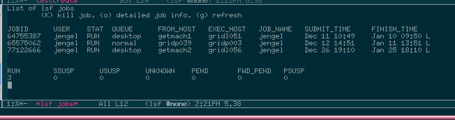
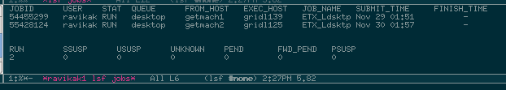
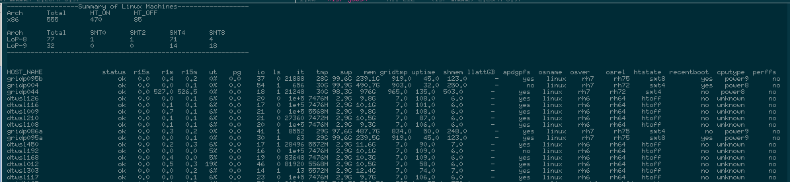
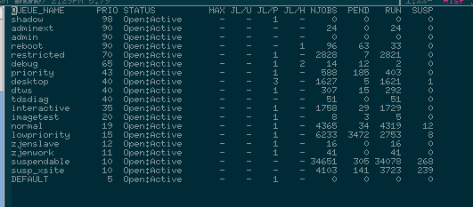
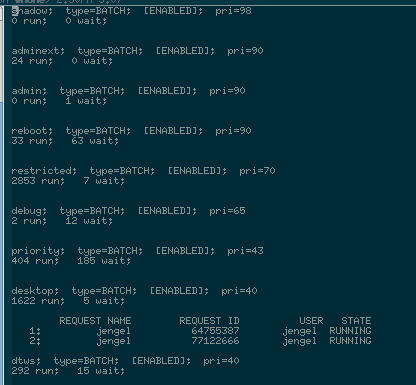
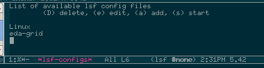
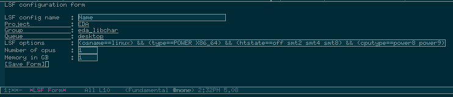
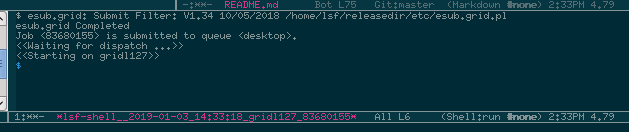

# LSF commands for emacs

This Emacs package allows easy interaction with LSF. Rather than having to open a shell and then
submitting a lsf job based on some script. 

This package allows a user to do any of the following:
1. Get a listing of the users existing lsf jobs.
2. Get more detailed info on any particular job.
3. Kill any job easily
4. Kill jobs within a region
5. Create configuration files for different lsf settings
6. Edit, delete and add new configuration files.
7. Get information on the lsf queues
8. Get information on the lsf queues you are using
9. Get information on the entire grid of machines and a summary per machine type.

## Installation

If you are using Emacs 24 or greater you can use Emacs package manager.
Add an additional source to find packages, include Emacs code like this to your InitFile:

    (require 'package)
    (add-to-list 'package-archives '("IBMelpa" . "/afs/apd/projects/IBMelpa/"))

You can then use the normal package install to install this.

If not, you can clone this code into a directory that emacs can get to
and add the following to your init file.
(load-file "path-to-code/lsf.el")

The default values for lsf options can be overwritten by setting the following in you Emacs init file.
If can leave these out if you don't want to change them,

    (defvar lsf-configs-dir "~/.emacs.d/lsf-configs/"
      "Place to hold the lsf config files used to setup an lsf job"
      )
    (defvar lsf-default-queue	 "lowpriority"
      "The default lsf queue"
      )
    (defvar lsf-default-project	 "EDA"
      "The default lsf project"
      )
    (defvar lsf-default-group	 "eda_libchar"
      "The default lsf group"
      )
    (defvar lsf-default-numProc	 "1"
      "The default number of cpus"
      )
    (defvar lsf-default-numMem	 "1"
      "The default memor size in gb"
      )
    (defvar lsf-default-wallTime	 "719:00"
      "The default wall time. 30 days"
      )
    (defvar lsf-default-os	         "linux"
      "The default operating system"
      )

## Commands

The following commmands are available:

1. lsf-jobs
2. lsf-jobs-user
3. lsf-machines
4. lsf-queues
4. lsf-qstat
5. lsf-shell
6. lsf-configs

### lsf-jobs
This command will list all the jobs that you have submitted to lsf. 
It will also give you a summary of the jobs, like what is pending, running, suspended.....
 
It is where you can:
1. kill a job with the **K** command
2. get detail information on a job with the **o** command
3. refresh the job list with the **g** command

### lsf-jobs-user
This command will list all the jobs for user given when the command prompts you. 
You cannot interact with the jobs though since you do not own them.

### lsf-machines
This command will list all the machine in the lsf cluster and their status 
It will also give you a summary of the quantities of the different machines.

### lsf-queues
This command will list available queues in the cluster

### lsf-qstat
This command will list available queues and what queues you have job in.

### lsf-shell
This command will allow you to bring up a shell that will submit an lsf job. 
It will prompt you for some information
1. Machine type x86 or lop
2. If lop is selected then it will prompt for the smt value
3. Again if lop is selected it wll then ask if you want power 8 or 9
4. Next you will be prompted if you want to use the debug queue.
5. If you answered yes then it will prompt for the machine name.
6. If you selected x86 in step 1 then steps 2 and 3 are skipped

### lsf-configs
This command will list all available configuration that you have created. 
You can do the following on the configs:
1. Delete a config with the **D** command
2. Edit an existing config with the **e** command
3. Add a new config with the **a** command
4. Submit a config so that lsf will start a shell with that lsf job with the **s** command

### lsf-config  add a new config
This command will bring up a form to fill out with your lsf options. 
You must fill in the name for the field. 
You can hit enter on the selection fields and a list will come up that you can select. Or you can click with a mouse (heavens forbid) 
For the lsf options there are samples that you should edit and remove some of the options. 
When done hit enter in the [Save Form] button

### lsf-config  start a config
When you start a config this image show you want it looks like when the job responds. 
You may then enter any commands since you are on a new machine within Emacs.

